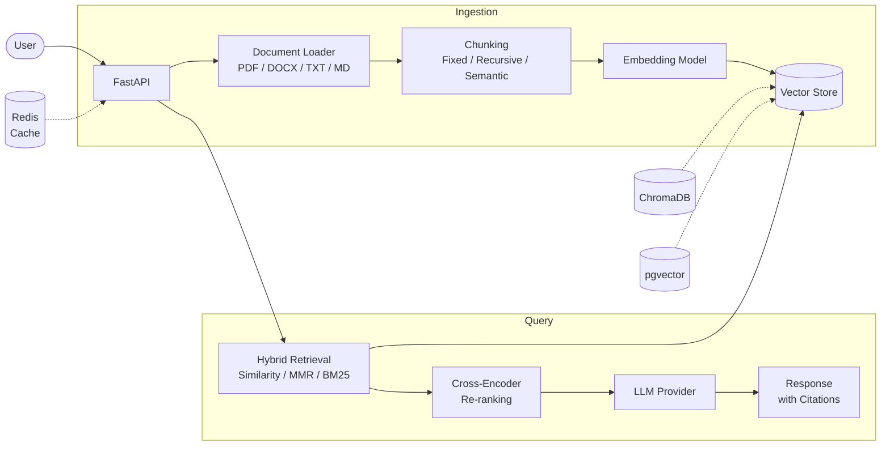

<!-- Updated March 2026 -->
# rag-document-qa


A production-grade Retrieval-Augmented Generation (RAG) pipeline for document question answering. Upload PDFs, DOCX, Markdown, or plain text files and query them with natural language. The system ingests documents through a configurable chunking pipeline, stores embeddings in a vector database, and answers questions using hybrid retrieval with optional cross-encoder re-ranking -- returning grounded responses with source citations.

## Architecture



## Features

- **Multi-format ingestion** -- PDF, DOCX, Markdown, and plain text with per-page/section metadata
- **Three chunking strategies** -- fixed-size, recursive, and semantic splitting
- **5 vector store backends** -- ChromaDB, pgvector, Pinecone, Weaviate, FAISS
- **Hybrid retrieval** -- similarity search, MMR (Maximal Marginal Relevance), and BM25 with reciprocal rank fusion
- **Cross-encoder re-ranking** -- optional second-stage re-ranking with `ms-marco-MiniLM-L-6-v2`
- **4 LLM providers** -- OpenAI, AWS Bedrock, Azure OpenAI, GCP Vertex AI
- **4 embedding providers** -- OpenAI, AWS Bedrock, Azure OpenAI, HuggingFace (local)
- **Source citations** -- every answer includes references back to the original document chunks
- **Streaming responses** -- SSE-based streaming for real-time answer generation
- **RAGAS evaluation** -- built-in faithfulness, relevance, and context precision scoring
- **Config-driven** -- single YAML file with full env var override support (`RAG_<SECTION>__<KEY>`)
- **Structured logging** -- JSON or console output via structlog

## Quick Start

```bash
git clone https://github.com/your-username/rag-document-qa.git
cd rag-document-qa

pip install -r requirements.txt

cp .env.example .env   # then fill in your API keys

uvicorn src.main:app --reload --host 0.0.0.0 --port 8000
```

The API will be available at `http://localhost:8000`. Interactive docs at `http://localhost:8000/docs`.

## API Reference

| Method   | Endpoint                  | Description                          |
|----------|---------------------------|--------------------------------------|
| `POST`   | `/documents/upload`       | Upload a document for ingestion      |
| `POST`   | `/query`                  | Ask a question against ingested docs |
| `POST`   | `/query/stream`           | Ask a question with streaming SSE    |
| `GET`    | `/documents`              | List all ingested documents          |
| `GET`    | `/documents/{id}`         | Get document metadata by ID          |
| `DELETE` | `/documents/{id}`         | Delete a document and its chunks     |
| `GET`    | `/health`                 | Health check                         |

### Upload a PDF

```bash
curl -X POST http://localhost:8000/documents/upload \
  -F "file=@report.pdf"
```

### Ask a question

```bash
curl -X POST http://localhost:8000/query \
  -H "Content-Type: application/json" \
  -d '{"question": "What are the key findings in the report?"}'
```

### List documents

```bash
curl http://localhost:8000/documents
```

### Delete a document

```bash
curl -X DELETE http://localhost:8000/documents/abc123
```

### Stream a response

```bash
curl -N http://localhost:8000/query/stream \
  -H "Content-Type: application/json" \
  -d '{"question": "Summarize the main conclusions."}'
```

## Configuration Reference

All options live in `config/config.yaml`. Override any value at runtime with environment variables using the pattern `RAG_<SECTION>__<KEY>`.

| Section | Key | Default | Description |
|---------|-----|---------|-------------|
| `embedding` | `provider` | `openai` | Embedding provider (`openai` or `huggingface`) |
| `embedding` | `model` | `text-embedding-3-small` | Model name for embeddings |
| `embedding` | `dimensions` | `1536` | Embedding vector dimensions |
| `llm` | `provider` | `openai` | LLM provider (`openai` or `bedrock`) |
| `llm` | `model` | `gpt-4o` | Model identifier |
| `llm` | `temperature` | `0.0` | Sampling temperature |
| `llm` | `max_tokens` | `2048` | Maximum tokens in response |
| `chunking` | `strategy` | `recursive` | Chunking strategy (`fixed`, `recursive`, `semantic`) |
| `chunking` | `chunk_size` | `1000` | Target chunk size in characters |
| `chunking` | `overlap` | `200` | Overlap between chunks in characters |
| `vectorstore` | `provider` | `chroma` | Vector store backend (`chroma` or `pgvector`) |
| `vectorstore` | `collection_name` | `documents` | Collection/table name |
| `vectorstore` | `persist_directory` | `./chroma_data` | ChromaDB persistence path |
| `vectorstore` | `pgvector_connection_string` | `postgresql+psycopg2://...` | PostgreSQL connection string for pgvector |
| `retrieval` | `top_k` | `5` | Number of chunks to retrieve |
| `retrieval` | `search_type` | `mmr` | Search type (`similarity`, `mmr`, `hybrid`) |
| `retrieval` | `mmr_lambda` | `0.5` | MMR diversity factor (0.0 = diverse, 1.0 = relevant) |
| `retrieval` | `reranker_enabled` | `false` | Enable cross-encoder re-ranking |
| `retrieval` | `reranker_model` | `cross-encoder/ms-marco-MiniLM-L-6-v2` | Re-ranker model |
| `api` | `host` | `0.0.0.0` | API bind host |
| `api` | `port` | `8000` | API bind port |
| `api` | `cors_origins` | `localhost:3000, localhost:8000` | Allowed CORS origins |
| `logging` | `level` | `INFO` | Log level (`DEBUG`, `INFO`, `WARNING`, `ERROR`, `CRITICAL`) |
| `logging` | `format` | `json` | Log format (`json` or `console`) |

## Supported Providers

### LLM Providers
| Provider | Models | Config Key |
|----------|--------|------------|
| OpenAI | GPT-4o, GPT-4-turbo | `openai` |
| AWS Bedrock | Claude 3 Sonnet/Opus, Titan | `bedrock` |
| Azure OpenAI | Any deployed model | `azure` |
| GCP Vertex AI | Gemini 1.5 Pro/Flash | `vertex` |

### Embedding Providers
| Provider | Models | Config Key |
|----------|--------|------------|
| OpenAI | text-embedding-3-small/large | `openai` |
| AWS Bedrock | Titan Embeddings V2 | `bedrock` |
| Azure OpenAI | Any deployed embedding model | `azure` |
| HuggingFace | all-MiniLM-L6-v2 (local) | `huggingface` |

### Vector Stores
| Store | Type | Config Key |
|-------|------|------------|
| ChromaDB | Embedded | `chroma` |
| pgvector | PostgreSQL | `pgvector` |
| Pinecone | Cloud | `pinecone` |
| Weaviate | Cloud/Self-hosted | `weaviate` |
| FAISS | Local/In-memory | `faiss` |

Switch providers in `config/config.yaml` without code changes.

## Chunking Strategies

| Strategy | Best For | Chunk Quality | Speed |
|----------|----------|---------------|-------|
| **Fixed** | Uniform-length documents, quick prototyping | Low -- splits at arbitrary character boundaries | Fast |
| **Recursive** | General-purpose use, structured text | High -- respects paragraph/sentence boundaries recursively | Moderate |
| **Semantic** | Research papers, mixed-topic documents | Highest -- groups semantically related content using embeddings | Slow |

**Fixed** splits text into equal-sized windows with configurable overlap. Simple but can break mid-sentence.

**Recursive** (default) attempts to split on paragraph breaks first, then sentences, then words, preserving natural text boundaries. Best balance of quality and performance.

**Semantic** uses an embedding model to detect topic boundaries and groups related passages together. Produces the most coherent chunks but requires an extra embedding pass during ingestion.

## Adding Your Own LLM Provider

1. Create a new function in `src/generation/chain.py` following the pattern of `get_openai_llm()` or `get_bedrock_llm()`:

```python
def get_custom_llm(config: LLMConfig):
    from langchain_community.llms import YourProvider
    return YourProvider(
        model=config.model,
        temperature=config.temperature,
        max_tokens=config.max_tokens,
    )
```

2. Register it in the `get_llm()` factory by adding your provider key:

```python
def get_llm(config: LLMConfig):
    providers = {
        "openai": get_openai_llm,
        "bedrock": get_bedrock_llm,
        "custom": get_custom_llm,  # add this
    }
    return providers[config.provider](config)
```

3. Add the provider literal to `LLMConfig` in `src/config.py`:

```python
class LLMConfig(BaseModel):
    provider: Literal["openai", "bedrock", "custom"] = "openai"
```

4. Set it in your config:

```yaml
llm:
  provider: "custom"
  model: "your-model-name"
```

## Evaluation

Run the RAGAS evaluation suite against your ingested documents:

```bash
python -m eval.run_eval --dataset eval/test_questions.json
```

Sample results:

| Metric | Score |
|--------|-------|
| Faithfulness | 0.85 |
| Relevance | 0.82 |
| Context Precision | 0.78 |

Results are written to `eval/results/` with per-question breakdowns for analysis.

## Docker

```bash
docker-compose up --build
```

This starts the API server, ChromaDB, and (optionally) PostgreSQL with pgvector. Configure via environment variables in `docker-compose.yml` or a `.env` file.

## Testing

```bash
# Run all tests
pytest

# Skip slow / integration tests
pytest -m "not slow and not integration"

# With coverage
pytest --cov=src --cov-report=term-missing
```

## Project Structure

```
rag-document-qa/
├── config/
│   └── config.yaml              # Application configuration
├── eval/                         # RAGAS evaluation scripts and datasets
├── src/
│   ├── __init__.py
│   ├── config.py                 # Config loader with env var overrides
│   ├── llm/
│   │   ├── base.py, factory.py
│   │   ├── openai_provider.py, bedrock_provider.py
│   │   ├── azure_provider.py, vertex_provider.py
│   ├── embeddings/
│   │   ├── base.py, factory.py
│   │   ├── openai_embed.py, bedrock_embed.py
│   │   ├── azure_embed.py, hf_embed.py
│   ├── vectorstore/
│   │   ├── base.py, factory.py
│   │   ├── chroma_store.py, pgvector_store.py
│   │   ├── pinecone_store.py, weaviate_store.py, faiss_store.py
│   ├── generation/
│   │   ├── __init__.py
│   │   ├── chain.py              # RAG chain, LLM providers, citations
│   │   └── prompts.py            # Prompt templates
│   ├── ingestion/
│   │   ├── __init__.py
│   │   └── loaders.py            # PDF, DOCX, TXT, Markdown loaders
│   └── retrieval/
│       ├── __init__.py
│       ├── vectorstore.py        # ChromaDB and pgvector backends
│       ├── hybrid.py             # BM25 index, hybrid search, RRF
│       └── reranker.py           # Cross-encoder re-ranking
├── tests/                        # pytest test suite
├── .env.example                  # Environment variable template
├── pyproject.toml                # Project metadata, ruff, pytest config
├── requirements.txt              # Python dependencies
└── LICENSE                       # MIT
```

## License

This project is licensed under the MIT License. See [LICENSE](LICENSE) for details.
